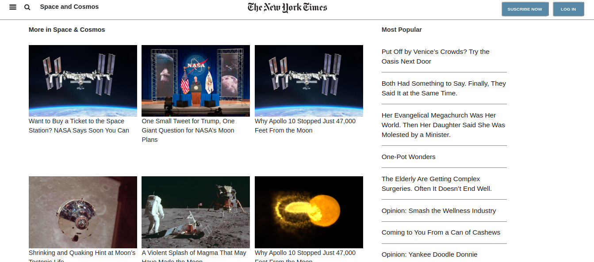

# Project: Basic HTML - New York Times

This collaborative project is based on the <a href="https://www.nytimes.com/2014/03/18/science/space/detection-of-waves-in-space-buttresses-landmark-theory-of-big-bang.html?_r=0">New York Times</a> website, and was built as part of an assignment for Microverse that required using HTML and CSS to create an article page.

## Built With

- HTML5
- CSS3

## Authors

👤 **Antonio Fernandes**

- Github: [@trox115](https://github.com/trox115)

👤 **Gonza Javier Mancilla**

- Github: [@gonjavi](https://github.com/gonjavi)
- Linkedin: [@g-javier-mancilla](https://www.linkedin.com/in/g-mancillla)

## Live Demo

[Live Demo Link](https://raw.githack.com/gonjavi/newyorktimes/development/index.html)

## 🤝 Contributing

Contributions, issues and feature requests are welcome!

## Show your support

Give a ⭐️ if you like this project!

## 📝 License

This project is [MIT](lic.url) licensed.

